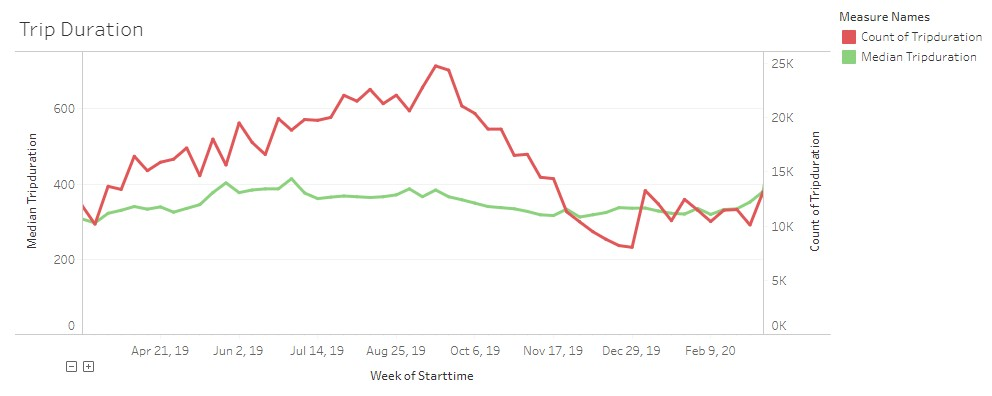
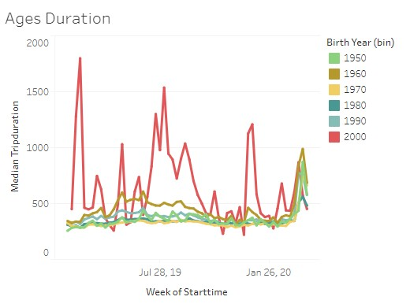
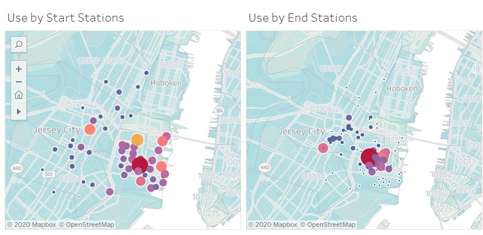
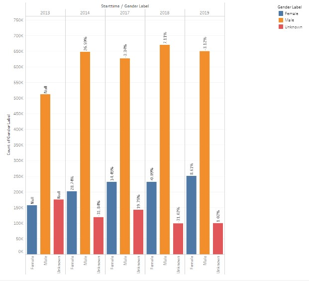

# Citi Bike Analytics

## Background:

The [New York Citi Bike](https://en.wikipedia.org/wiki/Citi_Bike) Program is the largest bike sharing program in the United States. In your new role, you will be expected to generate regular reports for city officials looking to publicize and improve the city program. Data is retrieved from [Citi Bike Data](https://www.citibikenyc.com/system-data) webpage.

The goal is to discover expected and unexpected trends or factors and summarize overall the usage across several factors.

Tableau stores can be found at:

- [Citi-Bike 2019](https://public.tableau.com/profile/david.durnell#!/vizhome/citi_bike_2019/Citi-BikeStory)
- [Gender Over Time](https://public.tableau.com/profile/david.durnell#!/vizhome/gender_over_time_15881962636640/GenderOverTime)

#### Several Interesting charts will be discussed here:

###### The above chart shows that usage peaks in September, when the weather is best, and the  is minimized during winter months. This is of course expected. It is interesting to note, however, that the median trip duration stays pretty constant. This may indicate the difference between users who rent bikes out of necessity and those that ride for pleasure.

###### This chart analyzes trip duration looks at how different ages use the bikes. It is interesting how young people use the bikes. They seem to keep them for long periods of time, perhaps overnight. That could be another area of analysis.

###### The second page of the first story maps the start and end stations, by popularity. It seems to show people traveling from the outskirts to business dense areas. It is curious that it isn't more even, as commuters would have to get home somehow. Perhaps they other means of transportation after work. Analyzing the same graphs during morning and evening would be another good avenue of analysis.

###### The second store uses the month of July over all the years to look at how the usage between genders has changed over time. It presents this bar chart and a dynamic pie chart. It shows two interesting conclusions:

1. There was a large jump in general between 2013 and 2014
2. The usage by males has remained pretty constant, while the usage by females has been creeping up, moderately

